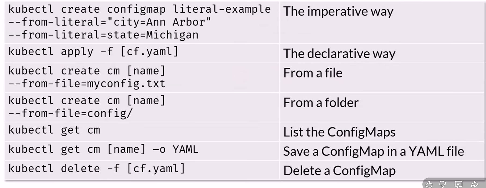

# Config Maps
Los ConfigMap, son unos componentes que nos permiten crear ficheros de configuración que luego pueden ser consultados por los pods y los distintos elementos del clúster.

Con esto, al a hora de cambiar una configuración en el clúster, esto hace posible que al cambiar en un solo sitio, el resto de componentes del clúster hereden ese cambio sin tener que tocar nada adicional.

Los valores que exponen los `config map` son accesibles por los recursos como variable de entorno.

Una cosa que hay que tener presente es que los recursos que consultan estos datos tienen que ser recreados para que pueda leer el dato de la configuración. EJ: Si hay un pod corriendo que esta usando un valor, para que el pod pueda usar el valor actualizado posterior cambio de un `config map`, habrá que recrearlo.

Definición de config map
---
```yaml
apiVersion: v1
kind: ConfigMap
metadata:
  name: cm-example
data:
  state: Michigan
  city: Ann Arbor
  content: |
  Look this is
  my house!
```

Leyendo datos del config map desde un pod
---
```yaml
apiVersion: v1
kind: Pod
metadata:
  name: mypod
spec:
  containers:
    - name: myfrontend
      image: nginx
      env:
        - name: STATE # Nombre de variable de entorno que se configurará en el pod.
        # Definimos desde donde se coge el valor para la variable de entorno. En este caso, desde el "config map"
        valueFrom:
          configMapKeyRef:
            name: cm-example # nombre del recurso "config map"
            key: state # campo del config map que queremos consultar.
```

## Config Maps como filesystem
Una de las cosas que podemos hacer interesantes con los `config maps` es montarlos como filesystem.

Esta característica nos permite montar un filesystem que mapeará los valores del `config map` y los expondrá en un filesistem como ficheros, siendo la llave el fichero y el contenido el valor.

El filesystem se monta como `read-only`.

### Ejemplo de montaje de config map como fs
En este caso, veriamos como se monta un config map como un filesystem en los pods que se configuren.

Config map de ejemplo
---
```yaml
apiVersion: v1
kind: ConfigMap
metadata:
  name: cm-example
data:
  state: Michigan
  city: Ann Arbor
  content: |
  Look this is
  my house!
```

Montaje de config map en pod
---
```yaml
apiVersion: v1
kind: Pod
metadata:
  name: mypod
spec:
  volumes:
    # Creamos un nuevo volumen usando los valores de cm-example para montarlo como fs
    - name: volmap
      configMap:
        name: cm-example

  containers:
    - name: myfrontend
      image: nginx
      volumeMounts:
        # referenciamos volmap y lo montamos en el los contenedores
        - name: volmap
          mountPath: /etc/config
```

Cómo se verían los ficheros en el pod.

```bash
cat /etc/config/state # Michigan
cat /etc/config/city # Ann Arbor
cat /etc/config/content # Look this is\nmy house!
```

