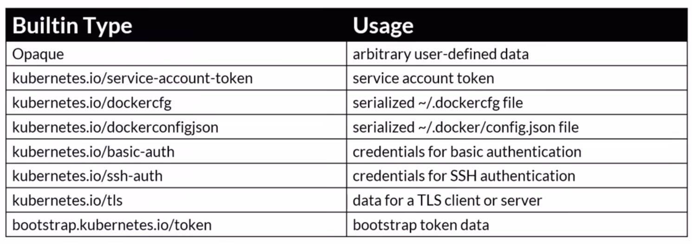

# Secrets
Los secrets son un componente que nos permite crear secretos ofuscados accesibles por los componentes del clúster.

Es un simil a los config maps, con la diferencia de que estan pensados para ocultar secretos (contraseñas, tokens, credenciales, seeds, etc...)

Existen diferentes tipos de secrets que nos permite crear estos datos de forma segura y pensados para cada caso de uso.

.

Los datos que se pasan al igual que con los config maps, se exponen en los pods como una variable de entorno decodificada de base64.

Los secrets también se pueden montar como [filesystem al igual que los config maps](../componentes/config-maps.md#config-maps-como-filesystem).

## Seguridad (opaque secrets)
Una de las cosas que hay que tener en cuenta es que los secretos por defecto (opaque) son almacenados como `strings base64` los cuales no es una forma segura de exponer esta información ya que esto no es un encriptado, es una codificación.

Una de las cosas que se recomienda realizar es la de tener bien controlados los `Role Based Access Control (RBAC)` los cuales nos permiten manejar los permisos de los usuarios.

## Almacenamiento externo de secretos
Opaque no termina de ser del todo seguro, por lo que lo que se recomienda realizar es tener un store de secretos y conectarlos al clúster para poder propagar los secretos con los componentes que lo requieran por ejemplo: Azure Key Vault, AWS Key Management Service, Google Cloud KMS; u otros proveedores más dedicados como puede ser Hashicorp Vault.

## Ejemplo de uso de un Secret
Para este caso crearemos un ejemplo sencillo para crear un secret y poder consumirlo en un pod.

```yaml
apiVersion: v1
kind: Secret
metadata:
  name: my-secret
type: opaque
data:
  username: dXN1YXJpbwo= # Valores base64
  password: Y29udHJhc2XDsWEK # Valores base64
```

```yaml
apiVersion: v1
kind: Pod
metadata:
  name: my-secret-pod
spec:
  containers:
    - name: myfrontend
      image: nginx
      env:
        - name: USERNAME
          valueFrom:
            secretKeyRef: # En vez de usar valueKeyRef usamos secretKeyRef para los secrets.
              # El resto de la referencia al secreto es igual a como cogemos los datos de los config maps.
              name: my-secret # nombre del componente que expone el secreto
              key: username # valor para la variable de entorno.
        - name: PASSWORD
          valueFrom:
            secretKeyRef:
              name: my-secret
              key: password
```

TODO: añadir más contexto del cómo se gestionan los secretos en el clúster de forma seguro y añadir más casos de uso para compartir y obtener secretos de proveedores de la nube.